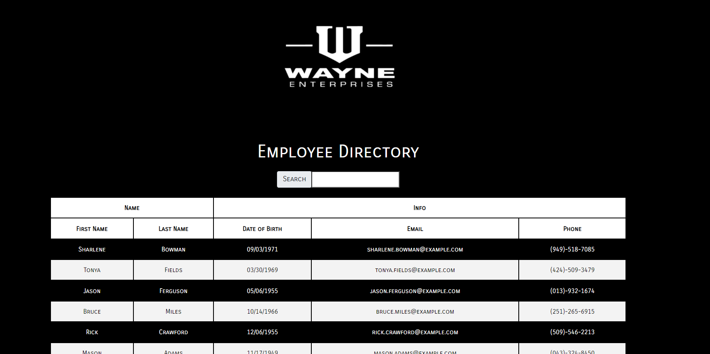
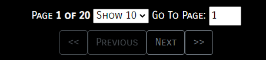
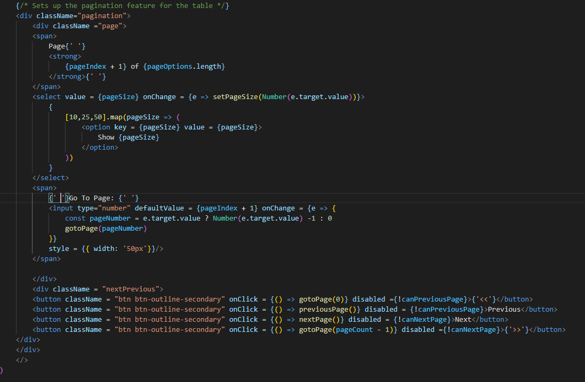
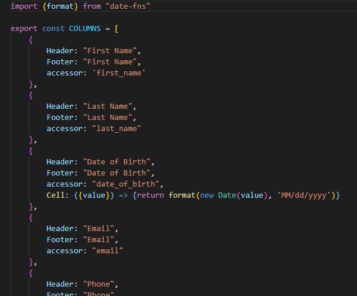
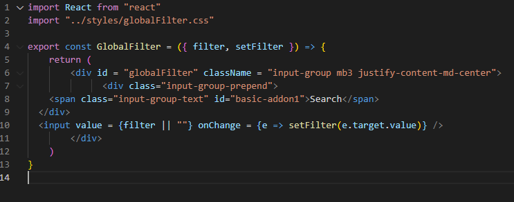
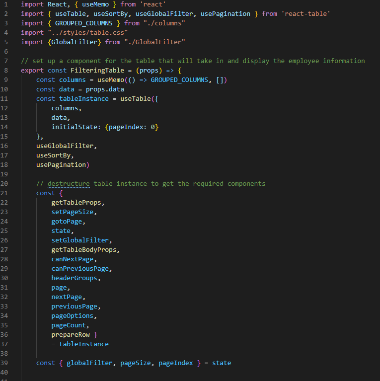

# Player Bank

[Description](#description) 

[Installation Instructions](#installation-instructions) 

[Site Overview](#site-overview) 
  

[Contribution Guidelines](#contribution-guidelines) 

[Tests](#tests) 
 
[Questions](#questions)

# Description

This is an employee directory application created using React and hosted on Github pages.  The application was created using the React.js framework and the user information was imported via a axios API call to the [Random User API](https://randomuser.me/).  The information is tabled using the React-Table package via Node.js which allows the user to access pagination, sort through the user data or filter by columns.  

## Installation Instructions

https://seanmonaghan.github.io/React_Employee_Directory/

No need to install this application, it is live via github pages and the link posted above.  

## Site Overview

This site functions as a fairly simple employee directory so that a company can better track their employees.  The application allows the user to search for an employee by their first name, last name, date of birth, email or phone number.  They can also organize the table by clicking on one of the headers to sort by ascending or descending order.  

The pagination functionality is created using a table and React-Table to filter the data presented based on the users preferences.  The user can either choose to display 10,25 or 50 individuals on the table using the setPageSize() functionality from React-Table.  They can navigate through these pages using the nextPage(), previousPage(), or gotoPage() functions from React-Table.

The columns are established prior to the construction of the table and must be speciied to our table component along with the data.  When creating the columns, it is important to add a Header and an accessor so that the table can determine what the header of the table should read as, and what data it is referencing from either your database or api call.  I added footer in this example to show that there are other options you could pass into the columns in case you or your client would like it styled differently.  You also only need to make a column for the data pertinent to your particular table.  

Another important note about the project is creating the global filter component.  In essence it's just a search input that calls the setFilter function on change so that as you input characters into the search bar it will filter the results for you.  Just be sure to export the global filter and import it on your table.js file so that you can include it in the creation of your table component.  

## License

This application uses the MIT license.

## Contribution Guidelines

If you would like to contribute to this project feel free to send requests.  I only wish that you be respectful to other contributes and to the code itself and maintain good clean coding practices. 

### Questions

If you have any questions about the application, be sure to contact me at my [e-mail](mailto:smonagha@conncoll.edu).

Alternatively you can find me and my other works at my [Github account](https://github.com/seanmonaghan).
